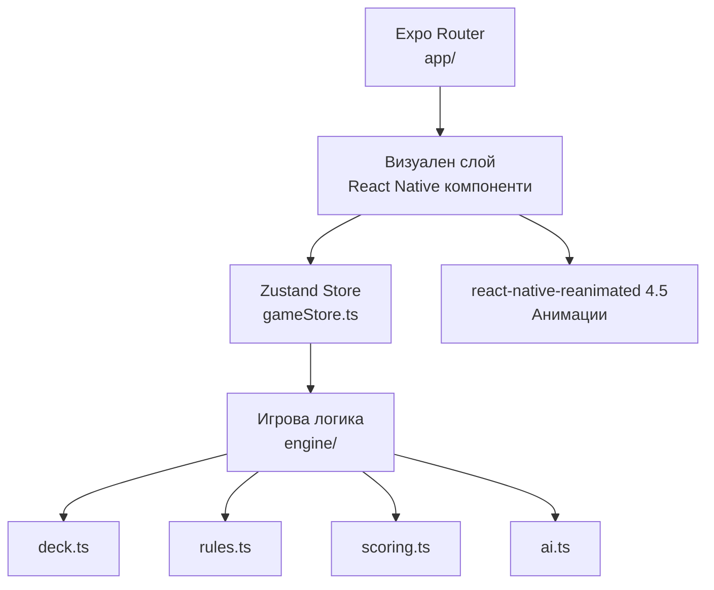
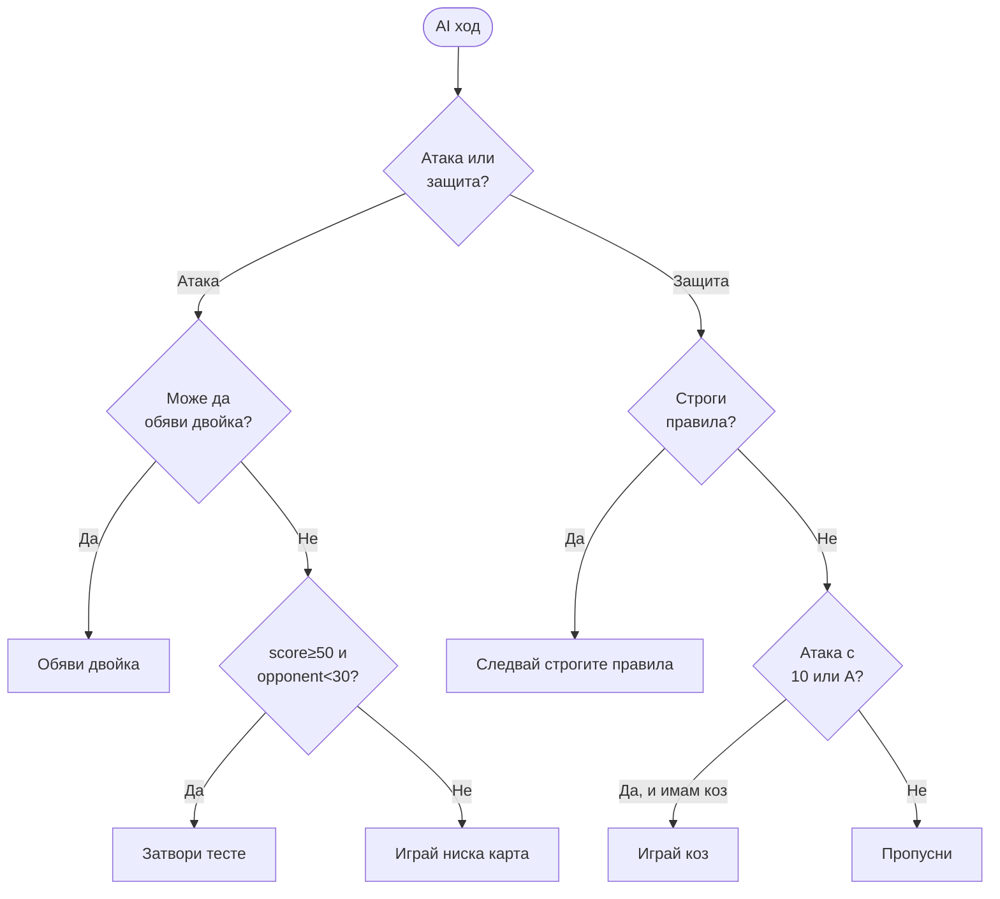

# Дизайн документ: Сантасе 66

## Overview

Сантасе 66 е класическа българска карточна игра за двама играчи — човек срещу AI. Приложението е напълно офлайн мобилно приложение, изградено с React Native + Expo SDK 57 (RN 0.86, React 19.2), TypeScript, Expo Router за навигация, react-native-reanimated 4.5 за анимации и Zustand за state management.

Целта на дизайна е ясно разделение между:
- **Игрова логика** — чисти TypeScript функции без зависимост от UI
- **State управление** — Zustand store, координиращ игровия процес
- **Визуален слой** — React Native компоненти с Reanimated анимации
- **Навигация** — Expo Router с файлова структура

## Architecture

```
src/
├── engine/          # Чиста игрова логика (без UI зависимости)
│   ├── deck.ts      # Тесте: създаване, разбъркване, точки
│   ├── rules.ts     # Валидация на ходове, строги правила
│   ├── scoring.ts   # Точкуване: карти, двойки, партии
│   └── ai.ts        # AI стратегия
├── store/
│   └── gameStore.ts # Zustand store — целия игрови стейт
├── components/
│   ├── Card.tsx     # Компонент карта с анимации
│   ├── Deck.tsx     # Тестето + козова карта
│   ├── Hand.tsx     # Ръка на играч / AI
│   ├── GameBoard.tsx # Игралното поле
│   └── ActionBar.tsx # Бутони: затвори, размени, обяви
└── app/             # Expo Router файлова навигация
    ├── _layout.tsx
    ├── index.tsx    # Начален екран
    ├── game.tsx     # Игрален екран
    ├── rules.tsx    # Правила
    └── settings.tsx # Настройки
```

### Диаграма на слоевете



### Ключови архитектурни решения

**1. Чиста игрова логика в `engine/`**
Всички функции в `engine/` са чисти (без странични ефекти), което позволява лесно тестване и потенциален reuse. Store вика engine функции и обновява стейта.

**2. Единствен Zustand Store**
Целият игрови стейт живее в един store. Компонентите се абонират само за нужните части чрез селектори, избягвайки излишни ре-рендери.

**3. Анимации на UI thread**
Всички анимации с Reanimated 4.5 се изпълняват на UI thread чрез `useSharedValue` и `useAnimatedStyle`, гарантирайки 60 fps без блокиране на JS thread.

**4. Expo Router — Stack навигация**
Приложението използва Stack навигация (`app/(stack)/`) — подходящо за линеен поток: Начало → Игра → Резултат.


## Components and Interfaces

### Expo Router навигация (`app/`)

```
app/
├── _layout.tsx       # Root Stack layout
├── index.tsx         # Начален екран (Home)
├── game.tsx          # Игрален екран
├── rules.tsx         # Правила
└── settings.tsx      # Настройки
```

`_layout.tsx` дефинира `<Stack>` с `headerShown: false` за всички екрани. Навигацията се реализира чрез `router.push('/game')` и `router.replace('/')`.

### Engine компоненти (`src/engine/`)

#### `deck.ts`

```typescript
export type Suit = '♠' | '♥' | '♦' | '♣';
export type Rank = '9' | 'J' | 'Q' | 'K' | '10' | 'A';

export interface Card {
  suit: Suit;
  rank: Rank;
  id: string; // `${rank}${suit}` — уникален идентификатор
}

// Точкови стойности по изискване 1.2
export const CARD_POINTS: Record<Rank, number> = {
  'A': 11, '10': 10, 'K': 5, 'Q': 4, 'J': 3, '9': 0,
};

export function createDeck(): Card[]         // 24 карти, всяка уникална
export function shuffleDeck(deck: Card[]): Card[]  // Fisher-Yates
export function getCardPoints(card: Card): number
export function dealHands(deck: Card[]): DealResult
// DealResult: { playerHand, aiHand, stock, trumpCard }
```

#### `rules.ts`

```typescript
export interface GameState { /* виж Data Models */ }

// Проверява дали дадена карта е валиден отговор при строги правила
export function isValidDefenseMove(
  attackCard: Card,
  defenseCard: Card,
  hand: Card[],
  trumpSuit: Suit,
  isStrictMode: boolean
): boolean

// Връща всички валидни карти за защита
export function getValidDefenseMoves(
  attackCard: Card,
  hand: Card[],
  trumpSuit: Suit,
  isStrictMode: boolean
): Card[]

// Проверява дали размяната на 9 е позволена
export function canSwapTrumpNine(state: GameState): boolean

// Проверява дали обявяване на двойка е позволено
export function canAnnouncePair(
  card1: Card, card2: Card,
  state: GameState
): boolean

// Проверява дали затварянето е позволено
export function canCloseStock(state: GameState): boolean
```


#### `scoring.ts`

```typescript
export interface TrickResult {
  winner: 'player' | 'ai';
  points: number;  // сума от двете карти
}

export interface HandResult {
  winner: 'player' | 'ai';
  partiesAwarded: 1 | 2 | 3;
  playerScore: number;
  aiScore: number;
}

// Изчислява броя партии за победителя
export function calculatePartiesAwarded(
  winnerScore: number,
  loserScore: number,
  loserTricks: number
): 1 | 2 | 3

// Общата точкова стойност на масив от карти
export function sumCardPoints(cards: Card[]): number

// Проверява дали играч е достигнал победа (≥66 точки)
export function hasReached66(score: number): boolean
```

#### `ai.ts`

```typescript
export interface AIDecision {
  action: 'play' | 'swap' | 'announce' | 'close';
  card?: Card;
  pair?: [Card, Card];
}

// Взима решение за AI хода въз основа на пълния стейт
export function getAIDecision(state: GameState): AIDecision

// Избира карта за атака (базова стратегия)
export function chooseAttackCard(hand: Card[], state: GameState): Card

// Избира карта за защита (включва строги правила)
export function chooseDefenseCard(
  attackCard: Card,
  hand: Card[],
  state: GameState
): Card
```

### UI компоненти (`src/components/`)

#### `Card.tsx`

```typescript
interface CardProps {
  card: Card | null;       // null = карта с лице надолу
  faceDown?: boolean;
  onPress?: () => void;
  isSelected?: boolean;
  animationId?: string;    // За Reanimated shared transitions
  style?: StyleProp<ViewStyle>;
}
```

Използва `useSharedValue`, `useAnimatedStyle` и `withTiming`/`withSpring` от Reanimated 4.5 за плъзгащи анимации.

#### `Hand.tsx`

```typescript
interface HandProps {
  cards: Card[];
  isPlayer: boolean;       // false = AI ръка (карти надолу)
  onCardPress?: (card: Card) => void;
  selectedCard?: Card | null;
  validMoves?: Card[];     // Осветява валидните карти
}
```

#### `Deck.tsx`

```typescript
interface DeckProps {
  stockCount: number;
  trumpCard: Card | null;
  isClosed: boolean;       // Затворено тесте
}
```

#### `ActionBar.tsx`

```typescript
interface ActionBarProps {
  canSwap: boolean;
  canAnnounce: boolean;
  canClose: boolean;
  announcablePairs: [Card, Card][];
  onSwap: () => void;
  onAnnounce: (pair: [Card, Card]) => void;
  onClose: () => void;
}
```


## Data Models

### Основни типове

```typescript
// Фазата на текущия ход
export type TurnPhase =
  | 'player-attack'    // Играчът атакува
  | 'player-defense'   // Играчът се защитава
  | 'ai-attack'        // AI атакува (обработва се автоматично)
  | 'ai-defense'       // AI се защитава (обработва се автоматично)
  | 'trick-resolution' // Анимация: взимане на хода
  | 'draw-phase'       // Теглене след ход
  | 'hand-over'        // Ръката приключи
  | 'game-over';       // Играта приключи

// Централен игрови стейт
export interface GameState {
  // Карти
  playerHand: Card[];
  aiHand: Card[];
  stock: Card[];           // Тестето (без козовата карта)
  trumpCard: Card | null;  // Козовата карта (видима под тестето)
  trumpSuit: Suit | null;

  // Текущ ход
  phase: TurnPhase;
  attackCard: Card | null; // Изиграна карта за атака
  defenseCard: Card | null;// Изиграна карта за защита

  // Взети карти (за изчисляване на точки)
  playerTricks: Card[];    // Всички взети карти от играча
  aiTricks: Card[];

  // Точки (карти + обявени двойки)
  playerScore: number;
  aiScore: number;
  playerTrickCount: number; // Брой взети ходове (за партии)
  aiTrickCount: number;

  // Специални действия
  isStockClosed: boolean;
  stockClosedBy: 'player' | 'ai' | null;
  announcedPairs: Array<{ player: 'player' | 'ai'; points: number }>;

  // Мета-информация
  handNumber: number;      // 1-базиран; двойки забранени на ръка 1
  playerParties: number;   // Партии (победа при 7)
  aiParties: number;
  isGameOver: boolean;
  winner: 'player' | 'ai' | null;
}
```

### Zustand Store интерфейс

```typescript
export interface GameStore extends GameState {
  // Инициализация
  startNewGame: () => void;
  startNewHand: () => void;

  // Действия на играча
  playCard: (card: Card) => void;
  swapTrumpNine: () => void;
  announcePair: (card1: Card, card2: Card) => void;
  closeStock: () => void;

  // Вътрешни (AI + автоматика)
  _resolveAITurn: () => void;
  _drawCards: () => void;
  _resolveTrick: () => void;
  _resolveHandEnd: () => void;
}
```

### AsyncStorage структура (персистиране)

```typescript
// Запазва само глобалната статистика (не активна игра)
interface PersistedStats {
  gamesPlayed: number;
  gamesWon: number;
}
// Ключ: '@santase/stats'
```


## Correctness Properties

*Свойство е характеристика или поведение, което трябва да е вярно при всяко валидно изпълнение на системата — формално твърдение за това какво трябва да прави системата. Свойствата служат като мост между четими от човек спецификации и машинно-верифицируеми гаранции за коректност.*

### Property 1: Инвариант на тестето — 24 уникални карти

*За всяко* новосъздадено тесте чрез `createDeck()`, резултатът трябва да съдържа точно 24 карти, всяка с уникална комбинация от ранг и цвят (6 ранга × 4 цвята = 24), без дубликати.

**Validates: Requirements 1.1**

---

### Property 2: Сумата от точките в тестето е 120

*За всяко* тесте от 24 карти, сумата от `getCardPoints(card)` за всички карти трябва да е точно 120 (4 × (11+10+5+4+3+0) = 120).

**Validates: Requirements 1.2**

---

### Property 3: Инвариант на броя карти в играта

*За всяко* валидно игрово състояние след раздаване, сумата `playerHand.length + aiHand.length + stock.length + (trumpCard ? 1 : 0) + playerTricks.length + aiTricks.length` трябва да е равна на 24.

**Validates: Requirements 1.3**

---

### Property 4: Козовата карта определя trumpSuit

*За всяко* ново тесте след раздаване, `gameState.trumpSuit` трябва да е равно на `gameState.trumpCard.suit`.

**Validates: Requirements 1.4**

---

### Property 5: Функцията за партии покрива всички случаи

*За всяко* двойка (loserScore, loserTricks) където loserScore е цяло число 0–65 и loserTricks ≥ 0, `calculatePartiesAwarded` трябва да върне:
- 3, ако loserTricks == 0
- 2, ако loserTricks > 0 и loserScore < 33
- 1, ако loserScore >= 33

**Validates: Requirements 4.2, 4.3, 4.4**

---

### Property 6: Строгите правила за защита са коректни

*За всяко* валидно игрово състояние с `isStockClosed = true` или `stock.length == 0`, при всяка карта, избрана от `getValidDefenseMoves`, тя трябва да спазва строгите правила: ако има карта от същия цвят на атаката — да е от същия цвят; ако няма — да е коз; ако няма коз — произволна карта.

**Validates: Requirements 2.5**

---

### Property 7: Round-trip на размяната на коз-девет

*За всяко* игрово стейт, при което `canSwapTrumpNine() == true`, след извикване на `swapTrumpNine()`, девятката трябва да е на дъното на тестето (trumpCard) и предишната козова карта да е в ръката на играча.

**Validates: Requirements 3.1**

---

### Property 8: AI ходовете са винаги валидни

*За всяко* игрово стейт, независимо от неговата конфигурация (отворено или затворено тесте, произволни ръце, произволен брой взети ходове), `getAIDecision(state)` трябва да върне действие с валидна карта — такава, която е в `aiHand` и съответства на правилата.

**Validates: Requirements 6.1, 6.2**

---

### Property 9: AI играе коз срещу силна карта при отворено тесте (от втора ръка)

*За всяко* игрово стейт с `isStockClosed == false`, `stock.length > 0`, `handNumber >= 2`, в което AI е на защита и противникът е изиграл карта с ранг '10' или 'A', ако `aiHand` съдържа поне 1 карта от `trumpSuit`, тогава `chooseDefenseCard()` трябва да върне карта от `trumpSuit`.

**Validates: Requirements 6.6**


## Error Handling

### Невалидни действия на играча

Всяко действие на играча се валидира преди изпълнение. При невалидно действие, store-ът не се обновява и се показва визуален сигнал (разтърсване на картата или бутона).

| Ситуация | Поведение |
|---|---|
| Играч изиграе карта извън своя ход | Игнорира се, без промяна на стейта |
| Играч обявява двойка в ръка 1 | Блокирано от UI; `canAnnouncePair` връща `false` |
| Играч размяна при затворено тесте | Блокирано от UI; `canSwapTrumpNine` връща `false` |
| Играч затваря вече затворено тесте | Блокирано от UI |
| Играч при строги правила изиграе невалидна карта | UI осветява само валидните карти; натискане на невалидна се игнорира |

### AI грешки

AI функциите са `pure functions` — при невалиден стейт хвърлят `Error` с описание. Store-ът прихваща грешката и ресетва до безопасно начално стейт (нова ръка).

### Край на тестето — edge cases

- Ако и двамата играчи нямат карти и тестето е празно: ръката приключва веднага, изчислява се резултат.
- Ако тестето е непарен брой (теоретично невъзможно при 24 карти и раздаване по 2): дефансивна проверка в `_drawCards`.

### Навигация

Expo Router осигурява типово-безопасна навигация чрез `href` типове. Натискане на "back" от игралния екран показва confirmation dialog преди да напусне играта.


## Testing Strategy

### Обзор на подхода

Използваме **двоен подход**: property-based тестове за игровата логика (чисти функции в `engine/`) и unit тестове с примери за конкретни сценарии. UI компонентите се тестват с snapshot тестове.

**Тестови фреймуърк:** Jest (вграден с Expo SDK 57) с `@jest/fake-timers` за AI закъснения.
**Property-based библиотека:** [fast-check](https://github.com/dubzzz/fast-check) — TypeScript-first, добре интегрирана с Jest, без допълнителни зависимости.

### Property-based тестове (engine/)

Всеки property тест се изпълнява минимум **100 итерации** с произволно генерирани данни.

Анотация за всеки тест:
```typescript
// Feature: santase-66, Property N: <текст на свойството>
```

**`deck.test.ts`** — тества Свойства 1, 2, 3, 4:
- `fc.assert(fc.property(...))` — за произволно разбъркване, тестето винаги има 24 уникални карти
- Сумата от точките винаги е 120
- Инвариантът на общия брой карти е запазен след всяка операция

**`scoring.test.ts`** — тества Свойство 5:
- `fc.integer({ min: 0, max: 65 })` за loserScore
- `fc.nat()` за loserTricks
- Проверява всичките три условия за партии

**`rules.test.ts`** — тества Свойство 6:
- Генерира произволни ръце и атакуващи карти
- При строги правила: всеки върнат ход трябва да е валиден

**`ai.test.ts`** — тества Свойства 8 и 9:
- Генерира произволни валидни `GameState` обекти
- Всеки AI ход трябва да е карта от `aiHand`
- При силна карта на противника и наличен коз: AI играе коз

**`swap.test.ts`** — тества Свойство 7:
- При `canSwapTrumpNine == true`: след `swapTrumpNine`, проверява размяната

### Unit тестове с примери

**`scoring.unit.test.ts`:**
- Точно 66 точки → `hasReached66 == true`
- 65 точки → `hasReached66 == false`
- Двойка от козов цвят = 40 точки, некозов = 20 точки
- Двойка в ръка 1 → `canAnnouncePair == false`

**`ai.unit.test.ts`:**
- AI с ≥50 точки и противник с <30 → `shouldClose == true`
- AI с K♠ + Q♠ на атака → решение е 'announce'

**`rules.unit.test.ts`:**
- Конкретни примери за строги правила (имаш цвят, нямаш цвят, имаш коз)
- Затворено тесте → `canSwapTrumpNine == false`

### Snapshot тестове (UI)

```typescript
// __tests__/components/Card.test.tsx
it('renders face-up card', () => {
  const tree = renderer.create(<Card card={aceOfSpades} />).toJSON();
  expect(tree).toMatchSnapshot();
});

it('renders face-down card', () => {
  const tree = renderer.create(<Card card={null} faceDown />).toJSON();
  expect(tree).toMatchSnapshot();
});
```

### Покритие

| Модул | Тип тест | Покрива изисквания |
|---|---|---|
| `engine/deck.ts` | Property (fast-check) | 1.1, 1.2, 1.3, 1.4 |
| `engine/scoring.ts` | Property (fast-check) | 4.2, 4.3, 4.4 |
| `engine/rules.ts` | Property + Unit | 2.5, 3.1, 3.3, 3.4 |
| `engine/ai.ts` | Property + Unit | 6.1, 6.2, 6.4, 6.6 |
| UI компоненти | Snapshot | 5.4, 5.5 |
| Store интеграция | Integration (3 примера) | 2.1–2.4, 3.2 |


## Детайлен дизайн на отделните модули

### Игрови поток (State Machine)

```mermaid
stateDiagram-v2
    [*] --> player-attack : startNewHand()
    player-attack --> trick-resolution : playCard() [AI е на атака]
    player-attack --> player-defense : playCard() [играчът атакува]
    player-defense --> trick-resolution : playCard() [отговор]
    trick-resolution --> draw-phase : анимацията завършва
    draw-phase --> player-attack : drawCards() [играч атакува]
    draw-phase --> ai-attack : drawCards() [AI атакува]
    ai-attack --> trick-resolution : _resolveAITurn()
    trick-resolution --> hand-over : score >= 66 OR stock empty + all played
    hand-over --> player-attack : startNewHand()
    hand-over --> game-over : parties >= 7
    game-over --> [*]
```

### Анимации с Reanimated 4.5

#### Изиграване на карта (плъзгане към центъра)

```typescript
// В Card.tsx
const translateX = useSharedValue(0);
const translateY = useSharedValue(0);
const opacity = useSharedValue(1);

const playCardAnimation = () => {
  // targetX/Y — координатите на центъра на масата
  translateX.value = withTiming(targetX, { duration: 300, easing: Easing.out(Easing.quad) });
  translateY.value = withTiming(targetY, { duration: 300, easing: Easing.out(Easing.quad) });
};

const animatedStyle = useAnimatedStyle(() => ({
  transform: [{ translateX: translateX.value }, { translateY: translateY.value }],
  opacity: opacity.value,
}));
```

#### Теглене от тестето

```typescript
// Карта "лети" от позицията на тестето до ръката
const scale = useSharedValue(0.8);
const drawAnimation = () => {
  translateX.value = withSpring(0, { damping: 15, stiffness: 150 });
  translateY.value = withSpring(0, { damping: 15, stiffness: 150 });
  scale.value = withSpring(1, { damping: 12 });
};
```

#### AI закъснение (0.5–1 секунда)

AI ходът се изпълнява с `setTimeout` от 500–800ms преди `_resolveAITurn()`, симулирайки "мислене". Таймерът се изчиства при `unmount` за да избегнем memory leaks.

### EAS Build конфигурация

```json
// eas.json (в корена на проекта)
{
  "cli": { "version": ">= 12.0.0" },
  "build": {
    "development": {
      "developmentClient": true,
      "distribution": "internal"
    },
    "preview": {
      "distribution": "internal"
    },
    "production": {
      "ios": { "bundleIdentifier": "com.santase.classic66" },
      "android": { "buildType": "app-bundle" }
    }
  },
  "submit": {
    "production": {}
  }
}
```

`app.json` се допълва с:
```json
{
  "expo": {
    "ios": {
      "bundleIdentifier": "com.santase.classic66",
      "buildNumber": "1",
      "deploymentTarget": "16.0"
    },
    "android": {
      "package": "com.santase.classic66",
      "versionCode": 1,
      "minSdkVersion": 29
    }
  }
}
```

### Touch targets (Изискване 8.6)

Всички интерактивни елементи имат минимален размер 44×44 points:
- Карти: `minWidth: 60, minHeight: 88` (стандартен размер на карта — по-голям от минимума)
- Бутони за действия: `minHeight: 48, paddingHorizontal: 16`
- Бутони в началния екран: `minHeight: 52`

### Офлайн режим (Изискване 8.5)

Приложението не прави мрежови заявки. `expo-network` не е необходим. Всички assets са вградени в bundle-а. `AsyncStorage` е единственото I/O — само за статистика, не е критично за функционалността.


## AI стратегия

### Базова стратегия (MVP)

AI следва приоритизирана логика:

**При атака:**
1. Ако може да обяви двойка (K+Q, ≥2-ра ръка) → обявява
2. Ако `canSwapTrumpNine()` → размяна (ако козовата карта е силна)
3. Ако `score >= 50` и `opponentScore < 30` и тестето е отворено → затваря
4. Играе карта по следния приоритет: некозов J/Q/K с ниска точкова стойност (запазва козове и А/10)

**При защита (отворено тесте, ≥2-ра ръка):**
- Ако атакуващата карта е '10' или 'A' → отговаря с коз ако има (Изискване 6.6)
- Иначе → пропуска (за да запази силните карти)

**При защита (затворено/изчерпано тесте — строги правила):**
- Задължително следва `getValidDefenseMoves()` — в цвят, после коз, иначе произволна

### Диаграма на AI решенията




## Визуален дизайн

### Игрален екран

```
┌─────────────────────────────────┐
│  AI ръка (карти надолу)         │  ← 6 карти, faceDown
│  [🂠] [🂠] [🂠] [🂠] [🂠] [🂠]    │
├─────────────────────────────────┤
│  Резултат: AI: 0pt  Вие: 0pt   │
│  Партии:  AI: ●○○○○○○  Вие:○○  │
├──────────┬──────────────────────┤
│  Тесте   │    Маса              │
│  [🂠]×11 │  [  атака  ]         │
│  [🂡коз] │  [  защита ]         │
├──────────┴──────────────────────┤
│  [Затвори] [Размени] [Обяви ▼]  │  ← ActionBar
├─────────────────────────────────┤
│  Вашата ръка                    │
│  [🂡] [🂢] [🂣] [🂤] [🂥] [🂦]    │  ← touch targets ≥44pt
└─────────────────────────────────┘
```

### Цветова схема

- **Фон на масата:** Тъмно зелено (`#1B5E20`) — класически карточен вид
- **Карти:** Бяло с цветни символи (♥♦ = червено `#C62828`, ♠♣ = тъмно `#212121`)
- **Партии (точки за победа):** Оранжеви кръгчета `●` за спечелени, бели `○` за неспечелени
- **Бутони:** Матово бяло с лека прозрачност, за да се виждат на зелен фон

### Представяне на карти

Картите се рендерират като React Native `View` компоненти (не изображения), за да бъдат леки и мащабируеми. Цветът и рангът се показват като Unicode символи и текст. Козовата карта се показва с лека рамка/сянка, отличаваща я визуално.

## Зависимости (допълнителни пакети)

| Пакет | Версия | Цел |
|---|---|---|
| `expo-router` | `~5.0.0` | Файлова навигация |
| `react-native-reanimated` | `~4.5.0` | Анимации на UI thread |
| `react-native-gesture-handler` | `~2.32.0` | Touch/gesture поддръжка |
| `zustand` | `^5.0.0` | State management |
| `@react-native-async-storage/async-storage` | `^2.0.0` | Персистиране на статистика |
| `fast-check` | `^3.x` | Property-based тестове (dev) |

> **Забележка:** Преди инсталиране проверете compatibility с Expo SDK 57 на https://docs.expo.dev/versions/v57.0.0/ — особено за `expo-router` версията, тъй като Expo SDK 57 включва Expo Router v5.
